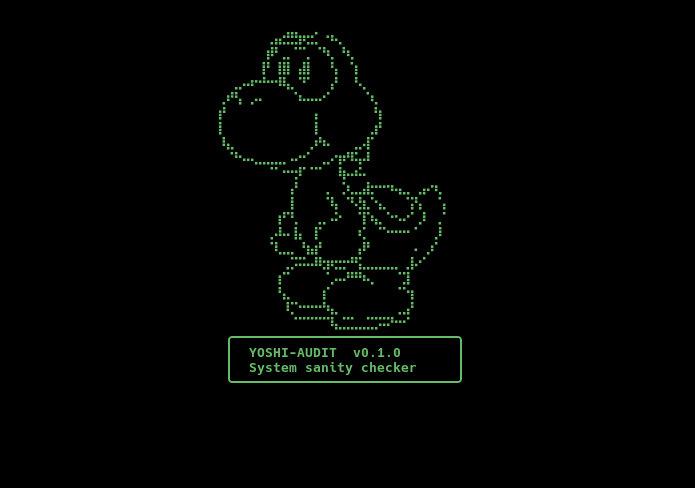
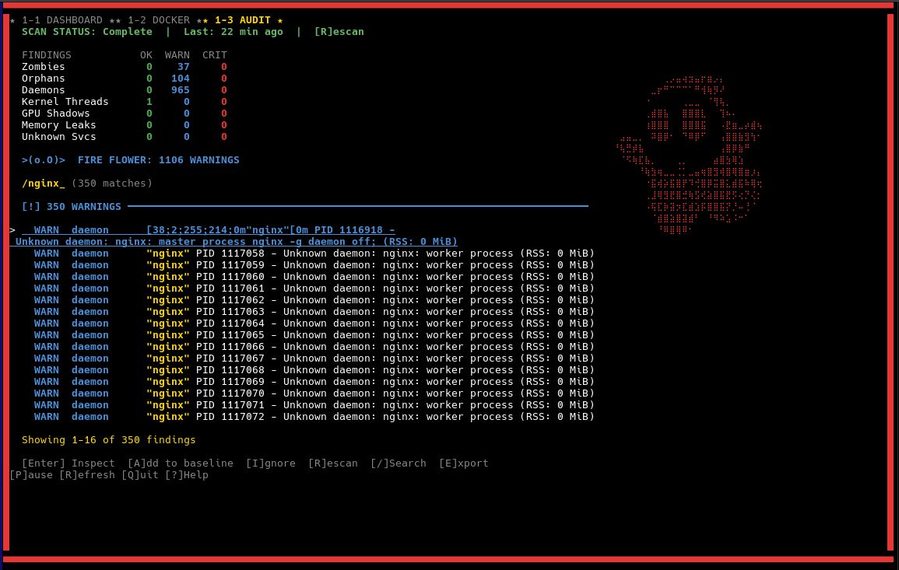
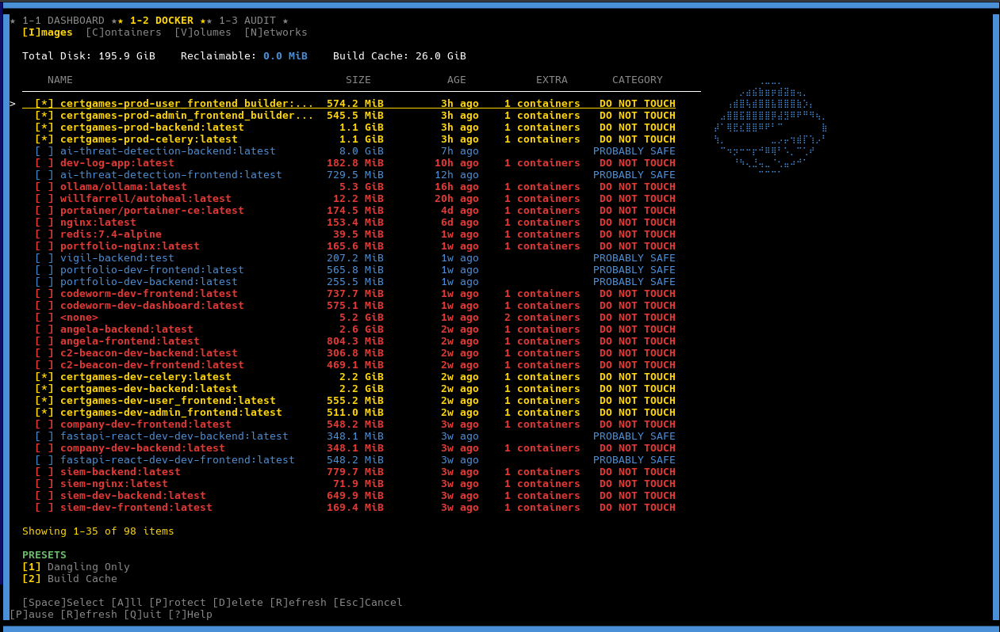
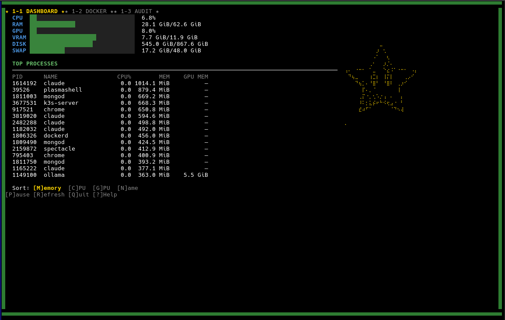

<!-- ©AngelaMos | 2026 -->
<!-- README.md -->

<div align="center">



<br/>

[](https://go.dev)
[](https://www.gnu.org/licenses/agpl-3.0)
[](internal/)
[](https://www.debian.org/)
[](https://github.com/charmbracelet/bubbletea)

<br/>

**System monitor, Docker prune manager, and deep process auditor — all in one retro-themed TUI.**

</div>

---

## What It Does

- **Live system dashboard** with CPU, RAM, GPU, VRAM, disk, and swap usage bars
- **Top processes table** sortable by memory, CPU, GPU, or name
- **Docker prune manager** with safety categorization, protection rules, and saved presets
- **Deep system audit** that scans for zombies, orphans, rogue daemons, GPU shadows, and memory leaks
- **Baseline learning** so future scans only flag genuinely new processes
- **Search and export** findings to JSON for offline analysis

## System Audit

Deep scan across 7 categories: zombies, orphans, unknown daemons, kernel threads, GPU shadows, memory leaks, and unknown services. Ships with a curated known-good list for Debian 13 + KDE Plasma and builds a personal baseline from your system over time. Search with `/` to filter findings live, export to JSON with `E`.

<div align="center">

</div>

## Docker Prune Manager

Interactive multi-select interface for cleaning up Docker resources. Every item is color-coded by safety level and anything matching production patterns (`*certgames*`, `*argos*`, `*mongo*`) is auto-protected. Presets let you save cleanup recipes. A confirmation screen shows exactly what will be removed before any destructive action.

<div align="center">

</div>

## Dashboard

Live-updating system overview with per-resource progress bars and a sortable top-N process table. Includes GPU and VRAM stats via `nvidia-smi`.

<div align="center">

</div>

## Quick Start

```sh
go install github.com/CarterPerez-dev/yoshi-audit/yoshi-audit@latest
yoshi-audit
```

> [!TIP]
> This project uses [`just`](https://github.com/casey/just) as a task runner. Type `just` to see all available commands.

```sh
just run          # run from source
just build        # production build to bin/
just test         # run all tests
just ci           # lint + test
```

## Keybindings

### Global

| Key | Action |
|-----|--------|
| `1` `2` `3` | Switch tabs |
| `Tab` | Cycle tabs |
| `P` | Pause/resume live updates |
| `Q` | Quit |

### Dashboard

| Key | Action |
|-----|--------|
| `M` | Sort by memory |
| `C` | Sort by CPU |
| `G` | Sort by GPU mem |
| `N` | Sort by name |

### Docker

| Key | Action |
|-----|--------|
| `I` `C` `V` `N` | Switch sub-tab (Images/Containers/Volumes/Networks) |
| `Space` | Select/deselect item |
| `A` | Select all |
| `P` | Toggle protection on item |
| `D` | Delete selected (with confirmation) |
| `1`-`4` | Apply saved preset |
| `R` | Refresh data |

### Audit

| Key | Action |
|-----|--------|
| `R` | Rescan system |
| `Enter` | Inspect finding details |
| `A` | Add process to baseline |
| `I` | Ignore finding |
| `/` | Search/filter findings |
| `Escape` | Clear search |
| `E` | Export findings to JSON |

## Configuration

```
~/.config/yoshi-audit/config.yaml      # settings, protection patterns, presets
~/.config/yoshi-audit/baseline.json    # learned process whitelist
```

## Requirements

- Go 1.24+
- Linux (reads `/proc` filesystem directly)
- Docker Engine (for Docker tab)
- `nvidia-smi` (optional, for GPU/VRAM stats)
